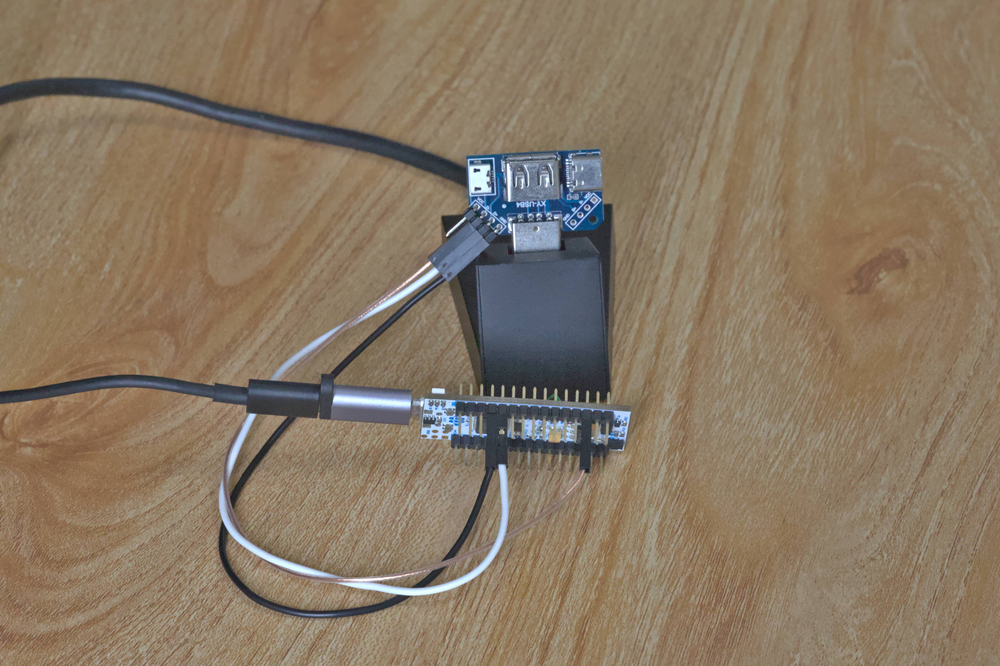

# CanoKey on STM32
[](https://travis-ci.com/canokeys/canokey-stm32) [](https://app.fossa.com/projects/git%2Bgithub.com%2Fcanokeys%2Fcanokey-stm32?ref=badge_shield)

CanoKey is an open-source USB/NFC security token, providing the following functions:

- OpenPGP Card V3.4 (RSA, ECDSA, ED25519 supported)
- PIV Card
- TOTP / HOTP (RFC6238 / RFC4226)
- U2F
- FIDO2 (WebAuthn)

It works on modern Linux/Windows/macOS operating systems without additional driver required.

**THERE IS ABSOLUTELY NO SECURITY ASSURANCE OR WARRANTY USING THE STM32 VERSION.**

**ANYONE WITH PHYSICAL ACCESS CAN RETRIEVE ANY DATA (INCLUDING SECRET KEYS) FROM THE KEY.**

**IT IS ALSO PRONE TO SIDE-CHANNEL ATTACKS.**

**YOU MUST USE IT AT YOUR OWN RISK.**

**A SECURE VERSION CAN BE FOUND AT https://canokeys.org**

## Hardware

This CanoKey-STM32 implementation is based on STM32L432KC MCU, which features a Cortex-M4 processor, 256KiB Flash, 64 KiB SRAM, and a full-speed USB controller. 

### CanoKey NFC-A

This official hardware design features a USB Type-A plug, NFC antenna and touch sensing. It's an open-source hardware design. Schematics and PCB design files are published at [canokey-hardware](https://github.com/canokeys/canokey-hardware).

### NUCLEO-L432KC (Development Board)
For demonstration purposes, you may run this project on the [NUCLEO-L432KC](https://os.mbed.com/platforms/ST-Nucleo-L432KC/) development board with the following hardware connection:

- D2 (PA12) <-> USB D+
- D10 (PA11) <-> USB D-
- GND <-> USB GND

Then connect the micro USB on NUCLEO to PC for powering and firmware downloading.



**The micro USB port on board connects to ST-LINK. Do not confuse it with USB signal pins of MCU.**

The NFC and touch sensing functions are unavailable on NUCLEO board.

## Build and test
### Build the Firmware

Prerequisites:

- CMake >= 3.6
- GNU ARM Embedded Toolchain, downloaded from [ARM](https://developer.arm.com/tools-and-software/open-source-software/developer-tools/gnu-toolchain/gnu-rm/downloads)
- git (used to generate embedding version string)

Build steps:

```shell
# clone this repo and all the submodules
# in the top-level folder
mkdir build
cd build
cmake -DCROSS_COMPILE=<path-to-toolchain>/bin/arm-none-eabi- \
    -DCMAKE_TOOLCHAIN_FILE=../toolchain.cmake \
    -DCMAKE_BUILD_TYPE=Release ..
make canokey.bin
```

Then download the firmware file `canokey.bin` to the STM32 with flash programming tools (e.g., ST-Link Utility if you use the NUCLEO-L432KC, or the [dfu-util](https://github.com/z4yx/dfu-util), or the [WebDFU](https://dfu.canokeys.org)).

### Initialize and Test

Prerequisites:

- Linux OS with pcscd, pcsc_scan and scriptor installed

Connect the CanoKey to PC, an USB CCID device should show up. The `pcsc_scan` command should be able to detect a smart card:

```shell
$ pcsc_scan
Using reader plug'n play mechanism
Scanning present readers...
0: Canokeys Canokey [OpenPGP PIV OATH] (00000000) 00 00
 
Sat Jan 22 20:26:49 2022
 Reader 0: Canokeys Canokey [OpenPGP PIV OATH] (00000000) 00 00
  Event number: 0
  Card state: Card inserted, 
  ATR: 3B F7 11 00 00 81 31 FE 65 43 61 6E 6F 6B 65 79 99

ATR: 3B F7 11 00 00 81 31 FE 65 43 61 6E 6F 6B 65 79 99
+ TS = 3B --> Direct Convention
+ T0 = F7, Y(1): 1111, K: 7 (historical bytes)
  TA(1) = 11 --> Fi=372, Di=1, 372 cycles/ETU
    10752 bits/s at 4 MHz, fMax for Fi = 5 MHz => 13440 bits/s
  TB(1) = 00 --> VPP is not electrically connected
  TC(1) = 00 --> Extra guard time: 0
  TD(1) = 81 --> Y(i+1) = 1000, Protocol T = 1 
-----
  TD(2) = 31 --> Y(i+1) = 0011, Protocol T = 1 
-----
  TA(3) = FE --> IFSC: 254
  TB(3) = 65 --> Block Waiting Integer: 6 - Character Waiting Integer: 5
+ Historical bytes: 43 61 6E 6F 6B 65 79
  Category indicator byte: 43 (proprietary format)
+ TCK = 99 (correct checksum)

Possibly identified card (using /home/zhang/.cache/smartcard_list.txt):
3B F7 11 00 00 81 31 FE 65 43 61 6E 6F 6B 65 79 99
        Canokey (Other)
        http://canokeys.org/
```

Then, initialize the CanoKey by running `device-config-init.sh`. This script will login as admin with default PIN `123456`, set device serial number to current Unix timestamp, configure the NFC AFE chip (if presents), then write an attestation certificate used by FIDO. Refer to [admin doc](https://doc.canokeys.org/development/protocols/admin/) if you want to customize these steps.

```shell
$ ./device-config-init.sh 'Canokeys Canokey [OpenPGP PIV OATH] (00000000) 00 00'
Reader name: Canokeys Canokey [OpenPGP PIV OATH] (00000000) 00 00
Using given card reader: Canokeys Canokey [OpenPGP PIV OATH] (00000000) 00 00
Using T=1 protocol
Reading commands from STDIN
> 00 A4 04 00 05 F0 00 00 00 00 
< 90 00 : Normal processing.
> 00 20 00 00 06 31 32 33 34 35 36 
< 90 00 : Normal processing.
> 00 FF 01 01 09 03 B0 05 72 03 00 B3 99 00 
< 6F 00 : No precise diagnosis.
> 00 FF 01 01 03 03 91 00 
< 90 00 : Normal processing.
> 00 FF 01 01 06 03 A0 44 00 04 20 
< 6F 00 : No precise diagnosis.
> 00 30 00 00 04 61 eb fc 55
< 90 00 : Normal processing.
> 00 01 00 00 20 cc d3 ee 4d ea 2a 3c ca d8 ce 3d 6a 47 f5 45 9c 80 79 7a d9 15 d6 f4 62 8b 5d 36 ef f2 76 d6 87
< 90 00 : Normal processing.
> 00 02 00 00 00 02 7b 30 82 02 77 30 82 01 5f a0 03 02 01 02 02 01 0d 30 0d 06 09 2a 86 48 86 f7 0d 01 01 0b 05 00 30 31 31 2f 30 2d 06 03 55 04 03 0c 26 43 61 6e 6f 4b 65 79 73 20 46 49 44 4f 20 41 74 74 65 73 74 61 74 69 6f 6e 20 52 6f 6f 74 20 43 41 20 4e 6f 2e 31 30 1e 17 0d 32 30 30 37 31 35 30 31 35 35 30 30 5a 17 0d 33 30 30 34 31 34 30 31 35 35 30 30 5a 30 66 31 20 30 1e 06 03 55 04 03 0c 17 43 61 6e 6f 4b 65 79 20 53 65 72 69 61 6c 20 30 30 31 31 34 35 31 34 31 22 30 20 06 03 55 04 0b 0c 19 41 75 74 68 65 6e 74 69 63 61 74 6f 72 20 41 74 74 65 73 74 61 74 69 6f 6e 31 11 30 0f 06 03 55 04 0a 0c 08 43 61 6e 6f 4b 65 79 73 31 0b 30 09 06 03 55 04 06 13 02 43 4e 30 59 30 13 06 07 2a 86 48 ce 3d 02 01 06 08 2a 86 48 ce 3d 03 01 07 03 42 00 04 06 5c 77 8f 90 f3 5b 30 fc 64 c0 ff db 6a ea 64 bb c7 bd c5 63 89 01 60 96 c2 6d ac 83 cf 54 63 47 07 d0 57 72 e2 55 06 4a 55 c4 00 c7 d3 67 32 4a b6 26 82 e3 58 22 06 1e b9 9a 52 2c 97 54 99 a3 30 30 2e 30 09 06 03 55 1d 13 04 02 30 00 30 21 06 0b 2b 06 01 04 01 82 e5 1c 01 01 04 04 12 00 00 24 4e b2 9e e0 90 4e 49 81 fe 1f 20 f8 d3 b8 f4 30 0d 06 09 2a 86 48 86 f7 0d 01 01 0b 05 00 03 82 01 01 00 40 e1 20 47 e0 53 70 85 8c 1b db 55 db a6 8b 1e 4c a3 9a c6 e4 54 b5 d9 e9 35 65 04 7a c8 0a 3e 9a 9f 61 79 ec 86 d4 e5 87 20 a3 4b 1c 60 21 98 71 a4 6d c4 a4 5a 22 bd f4 aa c4 0a c4 b1 c3 5d ad 4c 1f 52 a0 ec 22 0c 53 38 54 57 55 2b 83 a6 71 9a ad 1d 03 1e a6 30 87 f7 17 d1 53 86 96 88 17 6d 14 4e 9e d5 b9 f2 50 38 5a 86 c6 75 50 fa 42 f9 1d ec 3d 03 35 13 d4 fc 20 fc 44 e4 86 cd a2 21 99 a6 1b 42 23 fe 56 36 6b 2c ed 45 39 fc 47 32 bb 25 92 08 fb 0f e6 c3 2f 14 3c 87 af f5 11 36 3a fc 5a 62 19 dd b3 b6 e4 b7 88 e3 7f 31 b6 a3 8a 24 79 10 1b 16 e0 ec 87 23 0c 48 b4 33 2a 9b 8c 78 fd 1e 91 fe 45 e6 eb 32 22 eb 91 72 0d e5 f2 1f 52 52 bf e7 5a 61 7b f7 15 c4 4b 01 48 8b 40 35 4e 39 8c 80 5c a7 99 df c6 4c 27 75 43 cd 1f 96 8d a1 f2 2c 9e a5 d1 ea 87 41 64 02
< 90 00 : Normal processing.
```

After initialization, you are free to use CanoKey with applications, such as:

- GPG, e.g. `gpg --card-status`
- SSH with pkcs11, e.g. `ssh -I /usr/lib/x86_64-linux-gnu/opensc-pkcs11.so user@host`
- piv-tool
- Websites with U2F enabled, e.g., https://github.com/settings/security
- Websites with WebAuthn enabled, e.g., https://webauthn.me/
- CanoKey Web Console: https://console.canokeys.org/

### Internals

The hardware-independent code (including applets, storage, cryptography and USB stack) is in a submodule named [canokey-core](https://github.com/canokeys/canokey-core).

Major hardware-dependent components in this repo:

- `Drivers`: STM32 HAL Drivers
- `Src/device.c`: Hardware operations called by canokey-core
- `Src/lfs_init.c`: Flash operations used by file system
- `Src/main.c`: Hardware initialization
- `Src/usbd_conf.c`: USB interface
- `Src/retarget.c`: Glue logic between printf and UART
- `Src/admin_vendor.c`: Vendor-specific commands implementation

## Documentation

Check out our official [documentation](https://doc.canokeys.org).

## License

All software, unless otherwise noted, is licensed under Apache 2.0.

Unless you explicitly state, otherwise, any contribution intentionally submitted for inclusion in the work by you, as defined in the Apache-2.0 license without any additional terms or conditions.

All hardware, unless otherwise noted, is dual licensed under CERN and CC-BY-SA. You may use CanoKey hardware under the terms of either the CERN 1.2 license or CC-BY-SA 4.0 license.

All documentation, unless otherwise noted, is licensed under CC-BY-SA. You may use CanoKey documentation under the terms of the CC-BY-SA 4.0 license

[](https://app.fossa.com/projects/git%2Bgithub.com%2Fcanokeys%2Fcanokey-stm32?ref=badge_large)
